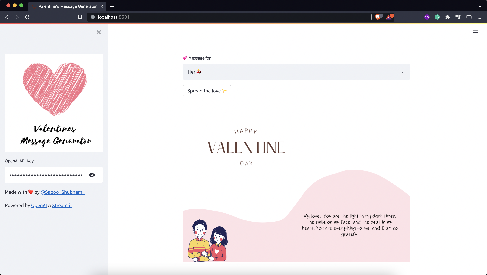

<h2 align="center"> 💖 Valentines's Message Generator powered by GPT-3 </h2>

> 🏁: **Access to OpenAI API Key is required to use this application**: It's simple to get with (no waitlist! + free credits!). If you don't have it, apply [here](https://openai.com/blog/api-no-waitlist/) ✌️


## 🎈 Try out the Live Application
```bash

```

### Application Interface 🕹️ 




## 💥 Bringing up the application Locally
🍴 Clone the `Valentines_Message_Generator` repository using the following command.

```bash
git clone https://github.com/Shubhamsaboo/Valentines_Message_Generator.git
```

You need to have python 3.7+ installed, and then you can create a python virtual environment using [pip](https://packaging.python.org/guides/installing-using-pip-and-virtual-environments/) or [conda](https://conda.io/projects/conda/en/latest/user-guide/tasks/manage-environments.html#activating-an-environment) depending on your python setup. 

After installing and activating the virtual environment (The commands will differ for windows and linux installations which is clearly specified in the respective documentations), you can run the following command to install the required dependencies.

```bash
pip install -r requirements.txt
```

After installing the required dependencies, you can bring up the main application to validate that its working in your local enviroment. To bring up the application, you can run the following command.

```bash
streamlit run app.py
```

## 🎨 How to create more such applications?
* Check out our GPT-3 Sandbox to create GPT-3 based applications for your specifc usecases.
* Check out my upcoming O'Reilly Book "[GPT-3: Building Innovative NLP Products using LLMs]()"
* Check out my [blog](https://shubhamsaboo111.medium.com/) for detailed walkthrough of various end-to-end GPT-3 based applications. 
